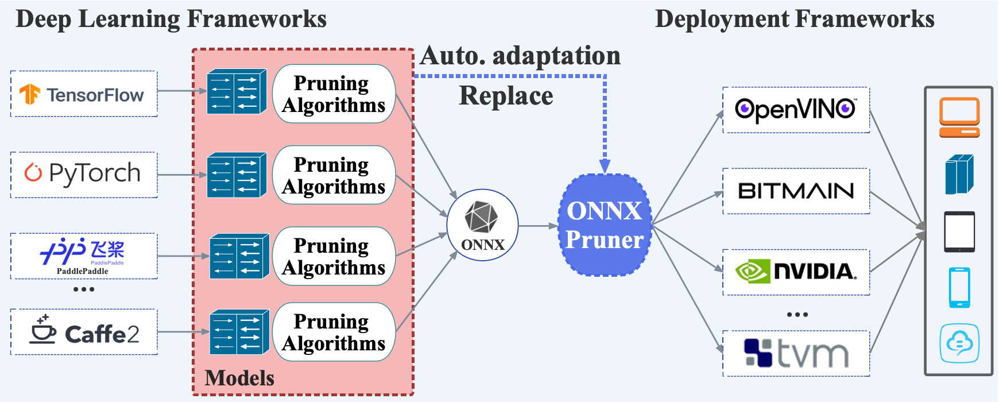

## Overview
This is the code of the paper: **ONNXPruner: ONNX-Based General Model Pruning Adapter**, [IEEE Transactions on Pattern Analysis and Machine Intelligence(**TPAMI**)](), 2025.

## Installation
- **We will update the code as soon as possible**

## Contributing

Contributions are welcome! Please open an issue or submit a pull request.